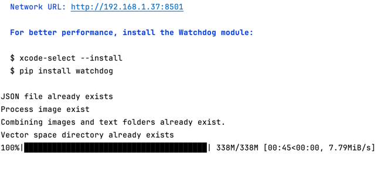

# RealState_Chatbot

##### PropBots is a modular Python project designed for production environments. It integrates data preprocessing, model management, and custom retrieval mechanisms for applications like document and image processing, model orchestration, and vectorized retrieval.

```
PropBots/
├── Artifacts/             # Processed data or model artifacts
├── build/                 # Compiled distributions and build scripts
├── Data/                  # Raw data used in the project
├── dist/                  # Distributable packages or executables
├── Logs_data/             # Logs for execution tracking
├── PropBots/              # Core project directory
│   ├── AgenticRetreival/   # Custom retrieval mechanisms (e.g. JSON)
│   ├── Config/             # Configuration files for data, models, etc.
│   ├── CustomPropException/ # Custom exceptions for error handling
│   ├── Model/              # Multi-model management (e.g. MultiModel.py)
│   ├── Preprocessing/      # Data processors for PDF, images, Excel
│   ├── PropVectorStore/    # Vector store implementations for retrieval
│   ├── retreiver/          # Query and retrieval management
│   ├── logger.py           # Centralized logging for the project
│   ├── utils.py            # Utility functions
├── sensor_detection.egg-info/  # Python project metadata
├── main.py                # Entry point of the project
├── setup.py               # Installation script
├── requirements.txt       # Python dependencies
└── README.md              # Project overview and instructions (this file)
```

### Features
1. Document Processing: Handle PDFs, Excel sheets, and image data.
2. Multi-Model Management: Manage and run models in a distributed environment.
3. Vectorized Retrieval: Efficient, model-based data retrieval using vector stores.
4. Logging: Robust logging system for tracking operations in production.
5. Docker Support: Run the entire application in a containerized environment.

###  Installation
#### Step 1: Clone the Repository
- ```git clone <repository-url>```
- ```cd PropBots```
- Alow It will download the OpenAI Clip Model Locally

- 

#### Step 2: Set Up Environment Variables
- Create an .env file to configure environment variables required for the project:

```
# Example .env file

# Logging level
LOG_LEVEL=INFO

# Data folder paths
DATA_PATH=/path/to/data

# Model configurations
MODEL_PATH=/path/to/models

# Vector Store configurations
VECTOR_STORE_PATH=/path/to/vector-store
```

#### Step 3: Install Dependencies
- You can install the dependencies using pip:

```pip install -r requirements.txt```
- Or use the included bash script for setup (which also handles virtual environments):

#### Step 4: Run Setup Bash Script

```bash setup.sh```

###### This script will:

- Install dependencies in a virtual environment.
- Check for necessary configurations.
- Set up logging and directories.

###### Here’s the setup.sh:

```#!/bin/bash

# Check if virtual environment exists, if not, create it
if [ ! -d "venv" ]; then
  python3 -m venv venv

# Activate virtual environment
source venv/bin/activate

# Install dependencies
pip install -r requirements.txt

# Export environment variables
if [ -f .env ]; then
  export $(cat .env | xargs)
else
  echo ".env file not found, please create one."
  exit 1
fi

# Run setup scripts if any additional setup is required
echo "Setup complete!"
```

##### Step 5: Docker Setup (Optional)
- A Dockerfile is included for containerization. To build and run the project in Docker:

1. Build the Docker image:

```docker build -t propbots .```

2. Run the container:
```docker run --env-file .env -v $(pwd)/Data:/app/Data -p 8000:8000 ```propbots

### Step 6: Run the Application
- Finally, to run the application, execute:

```python main.py```

- or inside Docker:
```docker run propbots```

##### Usage
1. Configure Data Paths: Modify config.py files inside the Config/ folder to align with your data and model requirements. 
2. Run Retrieval Tasks: You can use the modules in retreiver/ and PropVectorStore/ to run retrieval tasks on data. 
3. Process Documents: Use Preprocessing/ scripts to preprocess documents, images, and other file types.

##### Deployment
- To deploy PropBots in a production environment:

1. Ensure you have set up your .env file for environment-specific configurations.
2. Use Docker for deployment to ensure consistency across environments.
3. Set up automatic logging to track the application’s performance and issues.

##### Example Systemd Service for Deployment
- You can use the following systemd configuration for running PropBots as a service:


```[Unit]
Description=PropBots Service
After=network.target

[Service]
User=ubuntu
WorkingDirectory=/path/to/PropBots
ExecStart=/usr/bin/python3 main.py
EnvironmentFile=/path/to/PropBots/.env
Restart=always
RestartSec=10

[Install]
WantedBy=multi-user.target

```

- To use this:

1. Copy the file to /etc/systemd/system/propbots.service.
2. Reload systemd with sudo systemctl daemon-reload.
3. Start the service: sudo systemctl start propbots.service.
4. Enable at boot: sudo systemctl enable propbots.service.

### Testing
- Ensure all modules are functioning properly by running unit tests (if any) or performing manual tests on sample data. Add your custom test scripts under a tests/ folder.

### Contributing
- Feel free to fork the repository and create a pull request to contribute to the project. Ensure all new code is well-documented and follows Python best practices.